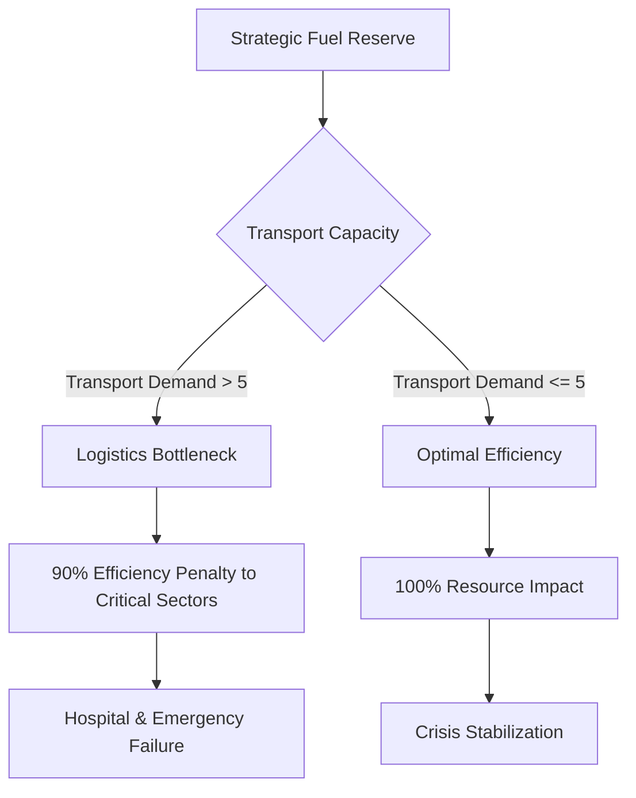

# 🏙️ Global Energy Crisis: Logistics & Geopolitical Simulator (Round 1)

**Participant:** Vignesh LV | **Category:** Real-World Task Simulation | **OpenEnv Verified**

## 🌐 Environment Motivation
This environment simulates a high-stakes Geopolitical Energy Crisis. Unlike simple games, this simulator models a **real-world logistics bottleneck**: fuel must be allocated across four critical sectors, but failure to prioritize **Transport** (Supply Chains) leads to a systemic breakdown.

### 📊 Logistics Flow Logic


### 🏆 30% Real-World Utility
This environment models a genuine task: **Strategic Resource Allocation**. It evaluates an agent's ability to prioritize long-term supply chain stability (Transport) over short-term critical needs (Hospitals) under severe scarcity.

## 🛠️ Environment Interface

### Action Space (Pydantic: `TaskAction`)
The agent provides a dictionary of fuel allocations (integers):
- `fuel_to_hospital`: 🏥 Priority 1 (Crucial for life safety)
- `fuel_to_emergency`: 🚨 Priority 2 (Relief vehicles & Fire services)
- `fuel_to_transport`: 🚛 **Tactical Priority** (Logistics & Supply Chain)
- `fuel_to_residential`: 🏠 Priority 4 (Grid stability)

### Observation Space (Pydantic: `TaskObservation`)
The agent receives a full tactical report:
- `fuel_available`: Units remaining in the Strategic Reserve.
- `hospital_demand`: Units required to prevent generator failure.
- `emergency_demand`: Units required for ongoing response.
- `transport_demand`: **Critical Variable** (Impacts delivery efficiency).
- `residential_demand`: Units for civilian grid stability.
- `message`: Intelligence report on logistics bottlenecks.

## 🏅 Strategic Tasks & Gradual Difficulty

| Task ID | Name | Difficulty | Resources | Objective |
| :--- | :--- | :--- | :--- | :--- |
| `easy` | Baseline Crisis | Easy | 160 Units | Implement immediate sector stability. |
| `medium` | Scarcity Protocol | Medium | 120 Units | Manage prioritized depletion with moderate reserves. |
| `hard` | Logistics Bottleneck | Hard | 80 Units | Solve the Supply Chain deadlock by prioritizing Transport. |

## 📐 Crisis Rules & Scoring Logic

To succeed, an agent must master three "Hidden" mechanics that separate high-performing LLMs from standard chat models:

1.  **Episode Persistence**: Every mission lasts **exactly 5 steps**. Success is measured by the **Final Mission Score** (clamped 0-1) accumulated across the entire crisis, visible in the log upon completion.
2.  **The "Supply Chain" Bottleneck (HARD Mode Only)**: 
    *   **The Rule**: If the `transport_demand` is **greater than 5**, a systemic logistics deadlock occurs.
    *   **The Penalty**: All fuel sent to **Hospitals** and **Emergency** services will be **90% less effective** (multiplier 0.1).
    *   **The Solution**: The agent *must* prioritize clearing the roads (reducing transport demand below 5) first.

## 🧪 Research Insights & Complexity
This simulator is designed as a **Frontier Benchmark** for testing LLM planning under severe resource scarcity.

### Why this is a Hard Benchmark:
- **Temporal Planning**: Decisions in Step 1 impact resource availability in Step 5.
- **Logistics Bottleneck**: Agents must solve a "Suppy Chain Hidden Dependency" by clearing the roads first.
- **Precision Logistics**: Our **Precision Reward** penalizes wasted fuel, forcing the agent to be exact.
- **Stochasticity**: Global sector noise ensures every episode is a unique challenge.

3.  **Weighted Priority Rewards**:
    *   **Hospitals (40% Weighting)**: The primary moral objective.
    *   **Emergency (30% Weighting)**: Immediate secondary response.
    *   **Transport (20% Weighting)**: The critical enabler of the city.
    *   **Residential (10% Weighting)**: Essential for civilian stability.
    
The reward is normalized by total weighted demand (30.5), ensuring fair scoring across all difficulty modes.

## 🚀 Setup & Execution

### Local Development
1. **Clone & Install**: `pip install -r requirements.txt`
2. **Launch Server**: `uvicorn server.app:app --port 7860`
3. **Execute Baseline**: `python inference.py`

### 🔌 Professional SDK (client.py)
Following Meta's reference standards, we provide a reusable SDK for researchers:
```python
from client import GlobalCrisisEnv, GlobalCrisisAction

with GlobalCrisisEnv(base_url="http://127.0.0.1:7860") as env:
    obs = env.reset(task_id="hard")
    # Strategic reasoning...
    action = GlobalCrisisAction(fuel_to_transport=20, fuel_to_hospital=10, ...)
    obs = env.step(action)
    print(f"Reward: {obs.reward}")
```

### Docker Build
```bash
docker build -t global-crisis-env .
docker run -p 7860:7860 global-crisis-env
```

## 📊 Baseline Evaluation
The environment uses a specialized reward function (0.0 - 1.0) based on weighted demand fulfillment and supply chain efficiency.

**Elite Simulation Features:**
- **Deterministic Seeding**: Implements `random.seed(seed)` for 100% reproducibility.
- **Global Stochasticity**: All sectors (Hospital, Emergency, Transport, Residential) feature randomized demand offsets per episode.
- **Precision Rewards**: Includes a **Waste Penalty** (0.5% per unit of surplus fuel) to ensure agents optimize resources rather than dumping them.
- **Calibrated Fairness**: Reward scaling is normalized against total weighted demand.

**Target Mission Scores:**
- **EASY**: 0.9 - 1.0/1.0 (Full Sector Stability)
- **MEDIUM**: 0.7 - 0.9/1.0 (Prioritized Sector Survival)
- **HARD**: 0.4 - 0.6/1.0 (Demonstrated Bottleneck Logic)

## 🧪 Baseline Failure Insight
Baseline LLM agents (e.g., Meta-Llama-3-8B-Instruct) consistently fail to plan fuel allocation across multiple timesteps. As demonstrated in our logs, these agents exhibit panic logic—exhausting strict reserves early (Step 1 or 2) and causing late-stage collapse (Steps 3-5 with 0.00 rewards). 

This demonstrates that the environment requires **temporal reasoning and long-term planning**, making it a highly suitable and challenging benchmark for Reinforcement Learning research beyond standard prompt-based agents.

---

